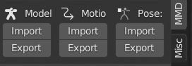
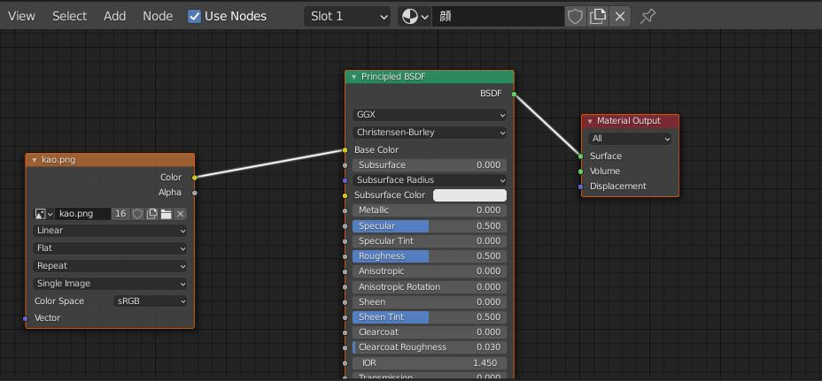
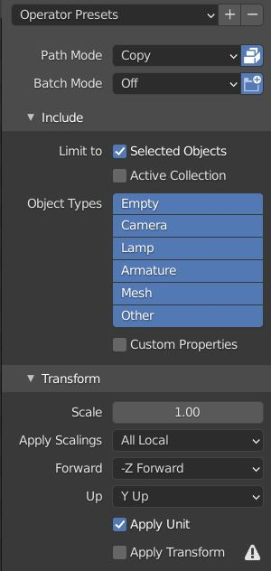
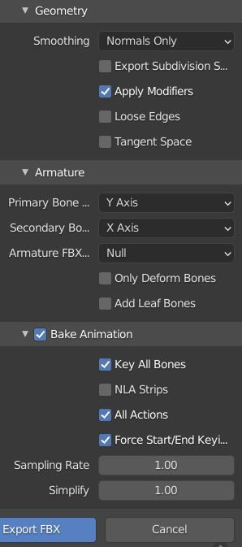
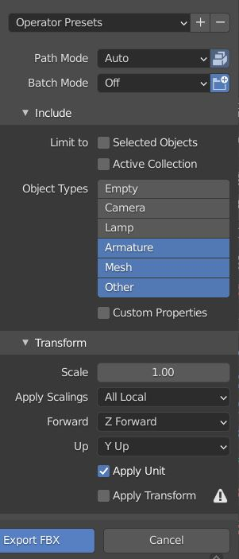
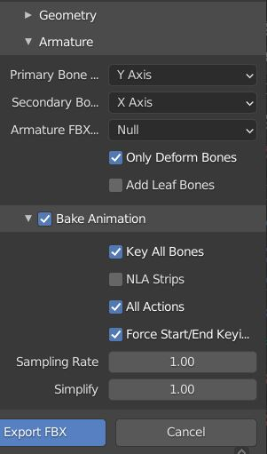
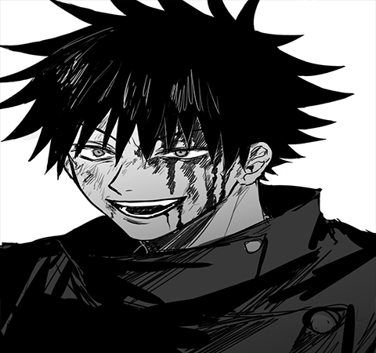
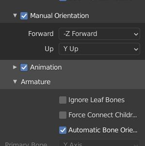
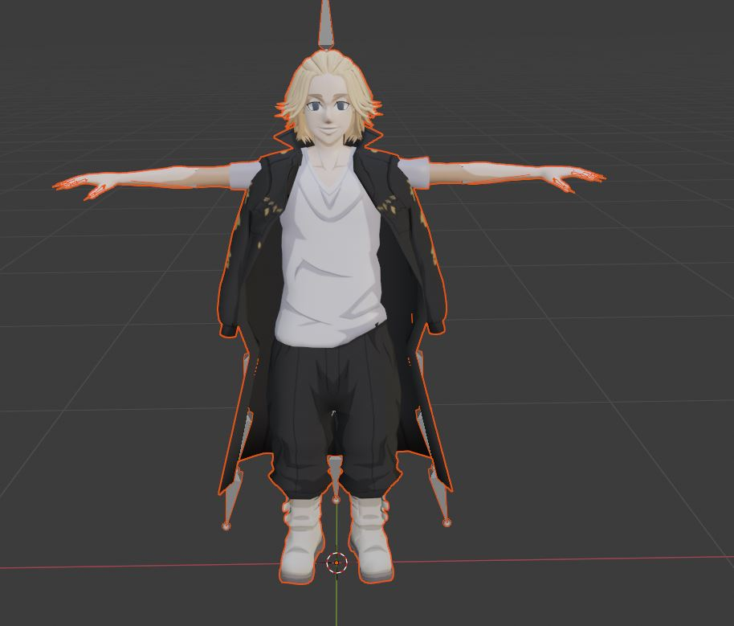

# AR Converter
1) Search your MMD model at bowlroll.net or any place. In my case I use this model "https://bowlroll.net/file/240466"
2) To download you gotta learn Japanese for the password key :D
3) Open Blender and import the model like below

4) Click at the Armature and import your mmd motion that you can download from devian art
5) Click at the Shading tab and add these three function like below 

7) Make sure the image is correct like the MMD version
8) Export to FBX like below [Without Motion]
Click on Mesh and Armature and follow the picture below

For motion use Adobe M

10) Export to FBX like below [With Motion]
Dont Click any mesh or armature and follow the picture below

11) That's how to create Megumi pmx to fbx

Another Way (Adding Animation to FBX)
1) Get your base fbx
2) Get animation but without skin
3) Import FBX but make sure it was like this

4) Import for Both base and animation
5) Copy animation from the animated one and Paste it on the base
6) Mikey said Bruh

# OBJ to AR
